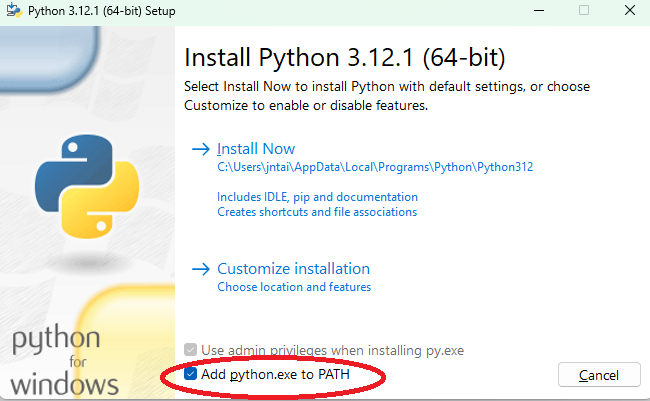

# Lab 4: UR5 and Motor Control

2.12/2.120 Intro to Robotics  
Spring 2024[^1]

- [Lab 4: UR5 and Motor Control](#lab-4-ur5-and-motor-control)
  - [0 (Prelab) Software Setup](#0-prelab-software-setup)
    - [0.1 Python](#01-python)
    - [0.2 UR5 RTDE](#02-ur5-rtde)
  - [1 Motor Modelling and Controller Design](#1-motor-modelling-and-controller-design)
  - [2 Validate Hardware Setup](#2-validate-hardware-setup)
    - [2.1 Validate Microcontroller](#21-validate-microcontroller)
    - [2.2 Validate Motors](#22-validate-motors)
    - [2.3 Validate Encoders](#23-validate-encoders)
    - [2.4 Validate Joystick](#24-validate-joystick)
  - [3 Tune Controller](#3-tune-controller)
  - [4 Drawing Revisited](#4-drawing-revisited)
  - [5 Feedback Form](#5-feedback-form)
  - [X Optional](#x-optional)

## 0 (Prelab) Software Setup

Estimated time of completion: 15 min

Before coming in to lab, please download and install the following software.

### 0.1 Python 

1. Download Python here: https://www.python.org/downloads/.
    <details>
    <summary><i> What version of Python do I need? </i></summary>

    We recommend at least 3.8 to ensure compatibility with the packages we will use in this class. If you already have Python, you should be able to check its version by entering the command `python --version` in your terminal. 

    </details>

    <details>
    <summary><i> Can I get Python via conda? </i></summary>

    We recommend getting vanilla Python. The staff may not be able to help troubleshoot issues relating to `conda`.

    </details>

2. Make sure to check "Add python.exe to PATH".
  
    <p align="center">
    
    </p>

3. Click "Install Now" and finish the installation.
4. Check that you installed Python correctly by entering the command `python` in your terminal. It should return `Python X.X (tags...`. 
    <details>
    <summary><i> It's returning something else? </i></summary>

    If it instead returns `python is not recognized as an internal or external command, operable program, or batch file` or `python: command not found`, you may have forgotten to add Python to PATH during installation. You can fix this using the following instructions: [How to Add Python to PATH](https://realpython.com/add-python-to-path/).

    </details>  

### 0.2 UR5 RTDE
For Windows: 
1. Open PowerShell in administrator mode by right-clicking and selecting "Run as administrator".
2. Enter `wsl --install`. This installs Windows Subsystem for Linux (WSL) with Ubuntu as the default distribution.
   
    <details>
    <summary><i> Not working? </i></summary>

    Please refer to this tutorial: [How to install Linux on Windows with WSL](https://learn.microsoft.com/en-us/windows/wsl/install.).
    </details>

3. Restart your machine.
4. Open Powershell and enter `wsl` to open a WSL terminal window. You might be asked to create a username and password. This can be whatever you want as long as you remember it.
5. Enter the following sequentially:
    ```
    sudo apt update
    sudo apt upgrade
    sudo apt install python3-pip
    pip3 install ur_rtde
    ```
    Tip: You can paste text from your clipboard by right-clicking in Powershell.

For Linux: 
1. Open Terminal.
2. Follow step 5 under "For Windows".

For MacOS:
1. Open Terminal.
2. Enter `/bin/bash -c "$(curl -fsSL https://raw.githubusercontent.com/Homebrew/install/HEAD/install.sh)"` to install [Homebrew](https://brew.sh/), a package manager similar to Linux `apt`.
3. Enter `echo "export PATH=/usr/local/bin:$PATH" >> ~/.bash_profile && source ~/.bash_profile` to add Homebrew to PATH.
4. Enter the following sequentially:
    ```
    brew update
    brew upgrade
    brew install boost
    brew install cmake
    
    git clone https://gitlab.com/sdurobotics/ur_rtde.git
    cd ur_rtde
    git submodule update --init --recursive
    mkdir build
    cd build
    cmake ..
    make
    sudo make install
    ```

    <details>
    <summary><i> Not working? </i></summary>

    We are still debugging why this doesn't work especially for Apple chip Macs. Feel free to send the staff an email with the error you are getting.
    </details>
    
   
Additional references:
- [Github (Example Codes)](https://github.com/mit212/ur_2024)
- [RTDE API Doc](https://sdurobotics.gitlab.io/ur_rtde/)

In lab, we will perform a supervised run-through of controlling the UR5.

## 1 Motor Modelling and Controller Design

Estimated time of completion: 20 min

Clone this repository. Open `matlab/MotorModel.mlx` in MATLAB and follow along the guided tutorial to find the nominal controller gains for the motors.

## 2 Validate Hardware Setup
Estimated time of completion: 10 min

Like in the previous labs, we first want to make sure the parts work individually! Faulty wiring or hardware can be very difficult to debug in complex systems.

### 2.1 Validate Microcontroller

**Make sure that motor power is turned off any time you are uploading code to your microcontroller.** The arm has a tendency to spin around and hit itself if motor power is on during upload. As a reminder, motor power should only be on when you expect the motors to move. Otherwise, please keep motor power off. 

<details> <summary> <i> How to know if the motor power is on? </i> </summary>

The yellow LED on the motor driver indicates whether motor power is on or off.
</details>

Clone this repository and run `robot/blink_test.cpp`. You should see the onboard LED change colors! 

<details> <summary> <i> Forget how to clone? </i> </summary>

Please refer to the [instructions from Lab 1](
https://github.com/mit212/lab1_2024?tab=readme-ov-file#31-git-clone).

</details>

### 2.2 Validate Motors

Orient the arm straight up, in default starting position. Run `test_code/motor_drive_test.cpp` to validate your motor setup. You should see both motors oscillating back and forth. Remember, motor 1 is attached to the base and motor 2 is attached to the second link. 

### 2.3 Validate Encoders

Run `test_code/encoder_test.cpp` to validate your encoder setup. Open the Serial Monitor to see the output and confirm that both the direction and the magnitude make sense!

### 2.4 Validate Joystick

Run `test_code/joystick_test.cpp` to validate your joystick setup. You should be able to see joystick readings within the range `[-1, 1]`.

## 3 Tune Controller
Estimated time of completion: 20 min

We will be using `lab_code/sinusoidal_input.cpp` to tune our controllers. We will tune the two motors separately.

1. Uncomment `#define MOTOR1` and comment out `#define MOTOR2`.
2. Update the parameters under the `#ifdef MOTOR1` section to be the nominal parameters computed from MATLAB. 
3. Run `lab_code/sinusoidal_input.cpp`.
4. Open `matlab/TuningPlot.m` in MATLAB. Update the COM port.
5. Run `matlab/TuningPlot.m` in MATLAB to visualize the performance of your controller. 
6. Tune your controller by incrementally changing `Ti1`, `Td1`, `Kp1`, and `alpha1` and seeing how that affects performance. Ideally, we want minimal overshoot, oscillations, and steady state error. 
7. Once you are satisfied with the performance, repeat the process for `MOTOR2`. 

## 4 Drawing Revisited
Estimated time of completion: 10 min

We will now use your tuned controllers to improve the drawing from last lab!

1. Open `lab_code/drawing.cpp` and update the parameters.
2. Set `trajectoryType = HORIZONTAL_LINE`.
3. Run `lab_code/drawing.cpp` and observe whether the arm performs better than last lab.
4. Open `matlab/TrajectoryPlot.m` in MATLAB. Update the COM port.
5. Run `matlab/TrajectoryPlot.m` to visualize the target and actual trajectories.
6. Set `trajectoryType = JOYSTICK` and run `lab_code/drawing.cpp` again.
7. Draw something awesome using your joystick!

| :white_check_mark: CHECKOFF 1 :white_check_mark:   |
|:---------------------------------------------------|
| Show your work of art to a TA or LA so we can pin it up on the board! |

## 5 Feedback Form

Before you leave, please fill out https://tinyurl.com/212-feedback. 

| :white_check_mark: CHECKOFF 2 :white_check_mark:   |
|:---------------------------------------------------|
| Show the feedback form completion screen to a TA or LA. |

## X Optional

Here are some optional challenges you can try if you finish lab early!
1. Run `lab_code/drawing.cpp` with `trajectoryType = VERTICAL_LINE`.
2. Run `lab_code/drawing.cpp` with `trajectoryType = CIRCLE`.
3. Connect the joystick to a separate microcontroller and make it wireless.
4. Try using another type of input besides the joystick. For example, you can use potentiometers or an IMU!

[^1]: Version 1 - 2020: Dr. Harrison Chin  
  Version 2 - 2021: Phillip Daniel  
  Version 3 - 2023: Ravi Tejwani and Kentaro Barhydt  
  Version 4 - 2024: Joseph Ntaimo, Jinger Chong, Josh Sohn
